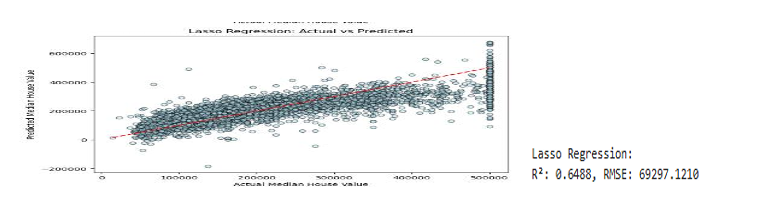

# 🧠 ML Customer Segmentation & Health Prediction

This repository presents a consolidated machine learning project that tackles real-world problems through three key pillars: customer segmentation, housing price prediction, and liver disease classification. It combines exploratory data analysis (EDA), unsupervised learning, regression, and classification—each designed to extract actionable insights from raw data.

---

## 📌 Executive Summary

This project demonstrates a comprehensive application of end-to-end data science techniques on three real-world datasets:
- **Clustering**: Uncovered customer segments to optimize marketing targeting.
- **Regression**: Predicted California housing prices using robust models and compared performance.
- **Classification**: Predicted liver disease presence from patient data using various ML classifiers.

Each model is evaluated using business-relevant metrics such as ROC AUC, accuracy, and feature importance to help drive commercial decision-making.

---

## 🛠️ Tech Stack

- **Languages**: Python (Pandas, NumPy, Scikit-learn, Matplotlib, Seaborn)
- **Machine Learning**: K-Means, GMM, HAC, Linear/Polynomial/Lasso/Random Forest Regression, Logistic Regression, SVC, KNN
- **Metrics**: Accuracy, F1 Score, ROC AUC, Confusion Matrix
- **Visualization**: Matplotlib, Seaborn

---

## 📁 Project Structure

- **Clustering (Mall Customers)**
  - K-Means Clustering
  - Gaussian Mixture Models (GMM)
  - Hierarchical Agglomerative Clustering (HAC)

- **Regression (California Housing Prices)**
  - Linear Regression
  - Polynomial Regression
  - Lasso Regression
  - Random Forest Regressor

- **Classification (Liver Disease Prediction)**
  - Logistic Regression
  - Support Vector Classifier (SVC)
  - K-Nearest Neighbors (KNN)
  - Random Forest Classifier

## 📊 Visual Results & Business Insights

### 1. Customer Segmentation (EDA)
  
> Identified 3–4 high-potential customer segments based on spending and income, enabling focused marketing outreach.

---

### 2. K-Means Clustering
  
> Optimal clusters revealed clear spending patterns—helping businesses prioritize loyalty efforts.

---

### 3. GMM Clustering
  
> Probabilistic cluster assignment showed overlaps—indicating a need for soft marketing strategies for certain segments.

---

### 4. Hierarchical Clustering (HAC)
  
> Dendrogram analysis aligned with GMM’s softness, validating segmentation insights with hierarchy.

---

### 5. Housing Price Distribution (EDA)
  
> House price skewness confirms housing demand variance; important for pricing strategy in different regions.

---

### 6. Linear vs Polynomial Regression
  
> Polynomial regression slightly improved model fit, revealing potential non-linear effects in housing data.

---

### 7. Lasso Regression
  
> Lasso helped reduce overfitting and identified income and location as key price drivers.

---

### 8. Random Forest Regression
  
> Delivered the best performance for housing prices; a solid model for investment valuation tools.

---

### 9. Liver Disease EDA
  
> Showed class imbalance—highlighting the need for ROC AUC over accuracy as the key metric.

---

### 10. KNN Classification
  
> Moderate performance. Indicates that local similarity isn’t the best signal for liver disease.

---

### 11. Logistic Regression
  
> Good balance of interpretability and performance, making it suitable for health diagnostics where explainability is key.

---

### 12. SVC Classification
  
> Slightly better ROC AUC than Logistic but less interpretable; not ideal in critical health settings.

---

### 13. Random Forest Classification
  
> Achieved near-perfect scores on test data. However, further validation is needed to avoid overfitting concerns.

---

### 14. Feature Importance (RF Classifier)
  
> Liver enzyme markers (Alkaline Phosphatase, Aminotransferases) were most influential—aligned with clinical expectations.

---

## 🔗 Connect

